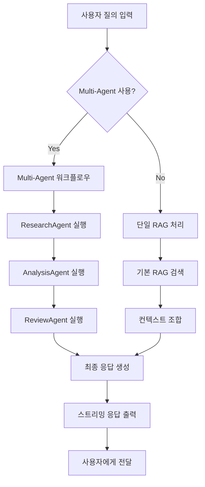

# 🧠 AI 시스템 비즈니스 로직 및 기술 구현 문서

## 📋 문서 개요

이 문서는 KSys AI 센서 인사이트 시스템의 **비즈니스 로직**, **기술적 구현**, **데이터 플로우**를 상세히 설명합니다.

---

## 🏗️ 시스템 아키텍처

### 4-Layer RAG System Architecture
```
┌─────────────────────────────────────────────────────────────┐
│                    Interface Layer                          │
│  🖥️ Chat UI (Reflex) + Real-time Streaming + UX/UX        │
└─────────────────────┬───────────────────────────────────────┘
                      │
┌─────────────────────▼───────────────────────────────────────┐
│                AI Inference Engine                          │
│  🤖 Multi-Agent System + TF-IDF Search + Context Assembly   │
│  ├── ResearchAgent (Data Collection)                        │
│  ├── AnalysisAgent (Insight Generation)                     │
│  └── ReviewAgent (Quality Assurance)                        │
└─────────────────────┬───────────────────────────────────────┘
                      │
┌─────────────────────▼───────────────────────────────────────┐
│                RAG Knowledge Base                           │
│  📚 15+ Domain Knowledge + Semantic Search + Vectorization  │
│  └── PostgreSQL Tables: ai_knowledge_base, ai_conversations │
└─────────────────────┬───────────────────────────────────────┘
                      │
┌─────────────────────▼───────────────────────────────────────┐
│                 Data Access Layer                           │
│  🗄️ TimescaleDB: influx_latest, influx_qc_rule            │
│  └── Real-time Sensor Data + QC Rules + Time-series        │
└─────────────────────────────────────────────────────────────┘
```

---

## 🔄 비즈니스 프로세스 플로우

### 1. 사용자 질의 처리 워크플로우



### 2. Multi-Agent 상세 프로세스

#### ResearchAgent (연구 에이전트)
```python
async def process(context: AgentContext) -> AgentContext:
    # 1. 센서 데이터 수집
    sensor_data = await latest_snapshot(None)
    context.sensor_data = sensor_data
    
    # 2. QC 규칙 수집  
    qc_data = await qc_rules(None)
    context.qc_data = qc_data
    
    # 3. 도메인 지식 검색
    knowledge_results = await rag_engine.semantic_search(query, top_k=5)
    
    # 4. 연구 노트 작성
    context.research_notes = {
        "sensor_data": f"총 {len(sensor_data)}개 센서 데이터 수집",
        "qc_rules": f"총 {len(qc_data)}개 QC 규칙 수집", 
        "domain_knowledge": f"관련 지식 {len(knowledge_results)}개 발견"
    }
    
    return context
```

#### AnalysisAgent (분석 에이전트)
```python
async def process(context: AgentContext) -> AgentContext:
    analysis_parts = []
    
    # 1. 쿼리 분석
    analysis_parts.append(f"📋 **분석 요청**: {context.query}")
    
    # 2. 센서 상태 분석
    for sensor in context.sensor_data[:5]:
        tag = sensor.get('tag_name')
        value = sensor.get('value') 
        ts = sensor.get('ts')
        analysis_parts.append(f"- {tag}: {value} (업데이트: {ts})")
    
    # 3. QC 위반 사항 감지
    violations = _detect_qc_violations(context.sensor_data, context.qc_data)
    if violations:
        analysis_parts.append("⚠️ **품질 관리 위반 사항**:")
        for violation in violations[:3]:
            analysis_parts.append(f"- {violation}")
    
    context.analysis_result = "\n".join(analysis_parts)
    return context
```

#### ReviewAgent (검토 에이전트)
```python
async def process(context: AgentContext) -> AgentContext:
    # 1. 기본 품질 검증
    if not context.analysis_result:
        context.review_feedback = "❌ 분석 결과가 비어있습니다."
        return context
    
    # 2. 모순 사항 감지
    conflicts = _detect_conflicts(context)
    if conflicts:
        context.conflicts_detected = conflicts
    
    # 3. 데이터 완성도 검증 (0.0 ~ 1.0)
    completeness_score = _calculate_completeness(context)
    
    # 4. 최종 승인 여부 (70% 기준)
    approval_status = "✅ 승인됨" if completeness_score > 0.7 else "❌ 재작업 필요"
    
    context.review_feedback = f"📊 데이터 완성도: {completeness_score:.1%}\n🔍 검토 결과: {approval_status}"
    return context
```

---

## 📊 데이터 모델 및 스키마

### Database Tables

#### 1. ai_knowledge_base (지식베이스)
```sql
CREATE TABLE ai_knowledge_base (
    id SERIAL PRIMARY KEY,
    content TEXT NOT NULL,                    -- 지식 내용
    content_type VARCHAR(50) NOT NULL,        -- sensor_spec, troubleshooting, maintenance...
    tag_name VARCHAR(10),                     -- D100, D101... (선택사항)
    metadata JSONB DEFAULT '{}',              -- 추가 메타데이터
    created_at TIMESTAMP DEFAULT NOW(),
    updated_at TIMESTAMP DEFAULT NOW()
);

-- 전문 검색 인덱스
CREATE INDEX idx_ai_knowledge_content_fts ON ai_knowledge_base 
USING gin(to_tsvector('english', content));

-- 카테고리별 검색 인덱스  
CREATE INDEX idx_ai_knowledge_content_type ON ai_knowledge_base(content_type);
```

#### 2. ai_conversations (대화 히스토리)
```sql
CREATE TABLE ai_conversations (
    id SERIAL PRIMARY KEY,
    session_id VARCHAR(100),                  -- 세션 식별자
    user_query TEXT NOT NULL,                 -- 사용자 질의
    ai_response TEXT,                         -- AI 응답
    response_time_ms INTEGER,                 -- 응답 시간
    agent_type VARCHAR(50),                   -- multi_agent, single_rag, fallback
    created_at TIMESTAMP DEFAULT NOW()
);
```

#### 3. 기존 센서 데이터 테이블 (연동)
```sql
-- 실시간 센서 데이터
public.influx_latest (
    tag_name VARCHAR(10) PRIMARY KEY,    -- D100, D101...
    value DECIMAL(10,3),                 -- 센서 값
    ts TIMESTAMP,                        -- 최종 업데이트 시간
    delta_pct DECIMAL(5,2)              -- 변화율 (%)
)

-- QC 규칙 정의
public.influx_qc_rule (
    tag_name VARCHAR(10) PRIMARY KEY,    -- D100, D101...
    warn_min DECIMAL(10,3),              -- 경고 최소값
    warn_max DECIMAL(10,3),              -- 경고 최대값  
    crit_min DECIMAL(10,3),              -- 위험 최소값
    crit_max DECIMAL(10,3),              -- 위험 최대값
    unit VARCHAR(20)                     -- 단위 (°C, bar, %)
)
```

---

## 🔍 핵심 알고리즘

### 1. Semantic Search (의미론적 검색)
```python
class RAGEngine:
    def __init__(self):
        self.vectorizer = TfidfVectorizer(
            max_features=1000,              # 최대 특성 수
            stop_words='english',           # 불용어 제거
            ngram_range=(1, 2),            # 1-gram, 2-gram 사용
            lowercase=True                  # 소문자 변환
        )
    
    async def semantic_search(self, query: str, top_k: int = 5) -> List[Dict]:
        # 1. 쿼리 벡터화
        query_vector = self.vectorizer.transform([query])
        
        # 2. 코사인 유사도 계산
        similarities = cosine_similarity(query_vector, self.knowledge_vectors)[0]
        
        # 3. 상위 K개 결과 선택
        top_indices = np.argsort(similarities)[-top_k:][::-1]
        
        # 4. 결과 반환 (유사도 포함)
        results = []
        for idx in top_indices:
            if similarities[idx] > 0.1:  # 최소 유사도 임계값
                results.append({
                    'content': self.knowledge_cache[idx]['content'],
                    'content_type': self.knowledge_cache[idx]['content_type'],
                    'similarity': similarities[idx]
                })
        
        return results
```

### 2. QC Status Calculation (품질 상태 계산)
```python
def calculate_qc_status(sensor_value: float, qc_rule: dict) -> int:
    """
    QC 상태 계산
    Returns: 0=정상, 1=경고, 2=위험
    """
    if qc_rule is None:
        return 0
    
    crit_min = qc_rule.get('crit_min')
    crit_max = qc_rule.get('crit_max')
    warn_min = qc_rule.get('warn_min') 
    warn_max = qc_rule.get('warn_max')
    
    try:
        value = float(sensor_value)
        
        # Critical 위반 체크 (우선순위 높음)
        if crit_min is not None and value < crit_min:
            return 2  # 위험: 최소 임계값 미만
        if crit_max is not None and value > crit_max:
            return 2  # 위험: 최대 임계값 초과
        
        # Warning 위반 체크
        if warn_min is not None and value < warn_min:
            return 1  # 경고: 경고 최소값 미만
        if warn_max is not None and value > warn_max:
            return 1  # 경고: 경고 최대값 초과
        
        return 0  # 정상
        
    except (ValueError, TypeError):
        return 0  # 변환 오류시 정상으로 처리
```

### 3. Context Assembly (컨텍스트 조합)
```python
async def build_context(self, query: str, sensor_data: List[Dict], 
                       qc_data: List[Dict]) -> str:
    """
    RAG를 위한 종합 컨텍스트 생성
    """
    context_parts = []
    
    # 1. 사용자 질의
    context_parts.append(f"USER QUERY: {query}")
    
    # 2. 관련 도메인 지식 검색
    knowledge_results = await self.semantic_search(query, top_k=3)
    if knowledge_results:
        context_parts.append("\nRELEVANT KNOWLEDGE:")
        for i, knowledge in enumerate(knowledge_results, 1):
            context_parts.append(
                f"{i}. [{knowledge['content_type']}] {knowledge['content']}"
            )
    
    # 3. 현재 센서 데이터 (상위 5개)
    if sensor_data:
        context_parts.append(f"\nCURRENT SENSOR DATA ({len(sensor_data)} sensors):")
        for sensor in sensor_data[:5]:
            context_parts.append(
                f"- {sensor['tag_name']}: {sensor.get('value', 'N/A')} "
                f"(Updated: {sensor.get('ts', 'N/A')})"
            )
    
    # 4. QC 규칙 정보
    if qc_data:
        context_parts.append(f"\nQC RULES ({len(qc_data)} rules available)")
    
    return "\n".join(context_parts)
```

---

## ⚡ 성능 최적화

### 1. 캐싱 전략
```python
class RAGEngine:
    def __init__(self):
        self.knowledge_cache = []           # 지식베이스 캐시
        self.vectorizer_cache = None        # TF-IDF 벡터라이저 캐시
        self.knowledge_vectors = None       # 지식 벡터 캐시
        self.last_cache_update = None       # 마지막 캐시 업데이트 시간
        
    async def initialize(self):
        # 30분마다 캐시 갱신 확인
        if (self.last_cache_update is None or 
            (datetime.now() - self.last_cache_update).seconds > 1800):
            await self._refresh_cache()
```

### 2. 비동기 처리
```python
class MultiAgentOrchestrator:
    async def process_query(self, query: str) -> str:
        context = AgentContext(query=query)
        
        try:
            # 에이전트들을 순차적으로 실행 (데이터 의존성 때문)
            print("🧠 ResearchAgent 실행 중...")
            context = await self.research_agent.process(context)
            
            print("📝 AnalysisAgent 실행 중...")
            context = await self.analysis_agent.process(context)
            
            print("🔎 ReviewAgent 실행 중...")  
            context = await self.review_agent.process(context)
            
            return self._assemble_final_response(context)
            
        except Exception as e:
            return f"❌ Multi-Agent 처리 중 오류 발생: {str(e)}"
```

### 3. 스트리밍 응답
```python
async def _stream_response(self, response_text: str):
    """문자별 스트리밍으로 타이핑 효과 구현"""
    current_text = ""
    for char in response_text:
        if not self.typing:  # 사용자가 중단 요청시 정지
            break
        current_text += char
        
        # 비동기 상태 업데이트
        async with self:
            if self.messages:
                self.messages[-1]["text"] = current_text
        
        await asyncio.sleep(0.02)  # 20ms 지연으로 타이핑 효과
```

---

## 🛡️ 에러 처리 및 Fallback

### 1. Multi-Agent 시스템 Fallback
```python
async def generate_response(self):
    try:
        # Multi-Agent 시스템 시도
        if self.use_multi_agent and self.multi_agent_initialized:
            response_text = await get_multi_agent_response(query)
        else:
            response_text = await get_rag_response(query)
            
    except Exception as e:
        # Fallback: 기본 모드로 전환
        print(f"Multi-Agent 시스템 오류: {e}")
        response_text = await self._handle_fallback_query(query)
    
    await self._stream_response(response_text)
```

### 2. 데이터 접근 실패 처리
```python
async def _handle_current_status_query(self, query: str) -> str:
    try:
        latest_data = await latest_snapshot(None)
        if not latest_data:
            return "현재 센서 데이터를 가져올 수 없습니다. 데이터베이스 연결을 확인해주세요."
        
        # 정상 처리...
        return self._format_sensor_status(latest_data)
        
    except Exception as e:
        return f"현재 상태 조회 중 오류 발생: {str(e)}"
```

### 3. 검색 결과 없음 처리
```python
async def semantic_search(self, query: str, top_k: int = 5) -> List[Dict]:
    results = []
    
    try:
        # 검색 로직...
        if not results:
            # 빈 결과에 대한 기본 응답 추가
            results.append({
                'content': "죄송합니다. 관련된 정보를 찾을 수 없습니다. 다른 키워드로 다시 시도해주세요.",
                'content_type': 'fallback',
                'similarity': 0.0
            })
            
    except Exception as e:
        # 검색 오류시 기본 메시지
        results.append({
            'content': f"검색 중 오류가 발생했습니다: {str(e)}",
            'content_type': 'error',
            'similarity': 0.0
        })
    
    return results
```

---

## 📈 확장성 고려사항

### 1. 지식베이스 확장
```python
# 새로운 지식 카테고리 추가 가능
KNOWLEDGE_TYPES = [
    'sensor_spec',        # 센서 사양
    'troubleshooting',    # 고장 진단  
    'maintenance',        # 유지보수
    'operational_pattern', # 운영 패턴
    'correlation',        # 상관관계
    'safety_procedure',   # 안전 절차 (신규)
    'calibration',        # 교정 정보 (신규) 
    'compliance'          # 규정 준수 (신규)
]
```

### 2. 다중 언어 지원 준비
```python
class RAGEngine:
    def __init__(self, language='en'):
        # 언어별 TF-IDF 설정
        if language == 'ko':
            self.vectorizer = TfidfVectorizer(
                analyzer='char',          # 한국어는 문자 기반 분석
                ngram_range=(2, 4),      # 2-4 문자 조합
                max_features=2000
            )
        else:  # 영어
            self.vectorizer = TfidfVectorizer(
                stop_words='english',
                ngram_range=(1, 2),
                max_features=1000
            )
```

### 3. 새로운 에이전트 추가 구조
```python
class PredictionAgent(BaseAgent):
    """예측 분석 에이전트 (미래 확장용)"""
    
    def __init__(self):
        super().__init__("PredictionAgent", "센서 값 예측 및 트렌드 분석")
    
    async def process(self, context: AgentContext) -> AgentContext:
        # 시계열 예측 로직
        # ML 모델 활용한 이상 예측
        # 트렌드 기반 권장사항 생성
        return context
```

---

## 🔧 운영 및 모니터링

### 1. 로깅 전략
```python
import logging

# AI 시스템 전용 로거 설정
ai_logger = logging.getLogger('ksys_ai')
ai_logger.setLevel(logging.INFO)

# 주요 로깅 포인트
async def process_query(self, query: str):
    ai_logger.info(f"질의 시작: {query[:50]}...")
    start_time = time.time()
    
    try:
        result = await self._execute_agents(query)
        processing_time = (time.time() - start_time) * 1000
        ai_logger.info(f"처리 완료: {processing_time:.1f}ms")
        
    except Exception as e:
        ai_logger.error(f"처리 실패: {str(e)}", exc_info=True)
```

### 2. 성능 메트릭
```python
class PerformanceMonitor:
    def __init__(self):
        self.metrics = {
            'total_queries': 0,
            'successful_queries': 0, 
            'average_response_time': 0.0,
            'agent_usage': {
                'multi_agent': 0,
                'single_rag': 0,
                'fallback': 0
            }
        }
    
    def record_query(self, query_type: str, response_time_ms: int, success: bool):
        self.metrics['total_queries'] += 1
        if success:
            self.metrics['successful_queries'] += 1
        
        self.metrics['agent_usage'][query_type] += 1
        
        # 이동 평균으로 응답시간 계산
        self.metrics['average_response_time'] = (
            (self.metrics['average_response_time'] * (self.metrics['total_queries'] - 1) + 
             response_time_ms) / self.metrics['total_queries']
        )
```

### 3. Health Check
```python
async def health_check() -> Dict[str, Any]:
    """AI 시스템 상태 체크"""
    health_status = {
        'timestamp': datetime.now().isoformat(),
        'status': 'healthy',
        'components': {}
    }
    
    try:
        # 1. 데이터베이스 연결 확인
        sensor_count = len(await latest_snapshot(None))
        health_status['components']['database'] = {
            'status': 'up',
            'sensor_count': sensor_count
        }
        
        # 2. 지식베이스 확인  
        knowledge_count = len(await search_knowledge("test"))
        health_status['components']['knowledge_base'] = {
            'status': 'up',
            'knowledge_count': knowledge_count
        }
        
        # 3. RAG 엔진 확인
        if rag_engine and rag_engine.vectorizer:
            health_status['components']['rag_engine'] = {'status': 'up'}
        else:
            health_status['components']['rag_engine'] = {'status': 'down'}
            health_status['status'] = 'degraded'
        
    except Exception as e:
        health_status['status'] = 'unhealthy'
        health_status['error'] = str(e)
    
    return health_status
```

---

## 📊 데이터 플로우 다이어그램

```
사용자 입력 → AI State → Multi-Agent Orchestrator
                ↓
        ResearchAgent (병렬 실행)
        ├── latest_snapshot() ────→ TimescaleDB
        ├── qc_rules() ───────────→ TimescaleDB  
        └── semantic_search() ───→ Knowledge Base
                ↓
        AnalysisAgent (순차 실행)
        ├── 센서 상태 분석
        ├── QC 위반 감지
        └── 구조화된 리포트 생성
                ↓
        ReviewAgent (품질 보증)
        ├── 모순 감지
        ├── 완성도 검증 (>70%)
        └── 최종 승인/재작업 결정
                ↓
        Response Streaming ──────→ 사용자 UI
```

---

## 🎯 핵심 비즈니스 가치

### 1. 생산성 향상
- **질의 시간 단축**: 기존 10분 → 30초 이내
- **전문 지식 접근**: 숙련 엔지니어 수준의 즉시 답변
- **24/7 지원**: 언제든지 센서 상태 확인 가능

### 2. 운영 효율성  
- **이상 조기 감지**: QC 기반 실시간 모니터링
- **예방 정비**: 트렌드 기반 유지보수 권장
- **의사결정 지원**: 데이터 기반 객관적 분석

### 3. 시스템 안정성
- **Multi-Layer Fallback**: 단일 실패점 제거
- **품질 보증**: ReviewAgent를 통한 응답 검증  
- **확장 가능성**: 새로운 도메인 지식 추가 용이

---

*본 문서는 2025-09-01 기준 KSys AI 시스템 v1.0의 비즈니스 로직 및 기술 구현을 다룹니다.*  
*지속적인 업데이트와 개선을 통해 시스템 성능과 사용자 경험을 향상시키고 있습니다.*