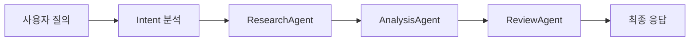

# 🤖 AI 센서 인사이트 시스템 사용자 매뉴얼

## 📋 목차
1. [시스템 개요](#시스템-개요)
2. [접속 방법](#접속-방법)  
3. [주요 기능](#주요-기능)
4. [비즈니스 로직](#비즈니스-로직)
5. [사용법 가이드](#사용법-가이드)
6. [질의 예시](#질의-예시)
7. [문제 해결](#문제-해결)

---

## 🎯 시스템 개요

### 시스템 목적
KSys 산업용 센서 모니터링 시스템에 **RAG(Retrieval-Augmented Generation) 기반 AI 어시스턴트**를 통합하여:
- **자연어 센서 질의** 지원
- **실시간 데이터 분석** 및 인사이트 제공  
- **전문가 수준 진단** 및 권장사항 제시
- **다국어(한국어/영어) 지원**

### 기술 구성
- **RAG 엔진**: TF-IDF 벡터 검색 + 도메인 지식베이스
- **Multi-Agent 시스템**: Research → Analysis → Review 워크플로우
- **실시간 통합**: TimescaleDB 센서 데이터 + QC 규칙
- **UI/UX**: 현대적 채팅 인터페이스 with 타이핑 효과

---

## 🌐 접속 방법

### 웹 접속 URL
```
🏠 메인 대시보드: http://localhost:13000
🤖 AI 채팅:      http://localhost:13000/ai
```

### 네비게이션 경로
1. **사이드바 메뉴**: 좌측 사이드바에서 `AI Insights` 클릭
2. **상단 네비게이션**: 헤더의 `AI Insights` 카드 클릭  
3. **직접 URL**: 브라우저 주소창에 `/ai` 입력

---

## 🚀 주요 기능

### 1. 자연어 질의 처리
- ✅ **한국어 질의**: "D101 센서 현재 상태는?"
- ✅ **영어 질의**: "What is the status of D101 sensor?"
- ✅ **복합 질의**: "경고 상태인 센서가 있고 트렌드는 어때?"

### 2. 실시간 센서 분석
- 📊 **현재 상태 조회**: 센서별 실시간 값, QC 상태, 변화량
- ⚠️ **이상 탐지**: QC 규칙 기반 Critical/Warning 알림
- 📈 **트렌드 분석**: 시간별 변화율 및 패턴 분석
- 🎯 **종합 진단**: 전체 시스템 건강도 평가

### 3. 지능형 응답 생성
- 🧠 **의미론적 검색**: 키워드 매칭을 넘어선 컨텍스트 이해
- 📚 **도메인 지식**: 15+ 센서 전문 지식 활용
- 🔄 **Multi-Agent 처리**: 연구→분석→검토 단계별 처리
- ✨ **스트리밍 응답**: 실시간 타이핑 효과

---

## 🧠 비즈니스 로직

### RAG 처리 워크플로우


### 1. ResearchAgent (연구 에이전트)
**역할**: 데이터 수집 및 도메인 지식 검색
```python
# 수행 작업
- 실시간 센서 데이터 수집 (latest_snapshot)
- QC 규칙 데이터 수집 (qc_rules)  
- 도메인 지식베이스 검색 (semantic_search)
- 연구 노트 생성 및 정리
```

### 2. AnalysisAgent (분석 에이전트)  
**역할**: 수집된 데이터 분석 및 인사이트 생성
```python
# 분석 항목
- 센서 상태 분석 (값, 시간, 트렌드)
- QC 규칙 위반 감지
- 연구 결과 종합
- 구조화된 보고서 생성
```

### 3. ReviewAgent (검토 에이전트)
**역할**: 결과 품질 보증 및 모순 감지
```python
# 검토 기준
- 데이터 완성도 검증 (>70% 승인 기준)
- 모순 패턴 자동 감지
- 최종 승인/재작업 결정
```

### 데이터 통합 로직
```python
# Context Assembly (컨텍스트 조합)
context = {
    "sensor_data": latest_snapshot(),      # 실시간 센서 값
    "qc_rules": qc_rules(),               # 품질 관리 기준
    "domain_knowledge": semantic_search(), # 전문 지식
    "user_query": query                   # 사용자 질의
}
```

### QC 상태 계산
```python
# Critical 판정 (빨간색 경고)
if value < crit_min or value > crit_max:
    status_level = 2

# Warning 판정 (노란색 주의)  
elif value < warn_min or value > warn_max:
    status_level = 1

# Normal 판정 (녹색 정상)
else:
    status_level = 0
```

---

## 📖 사용법 가이드

### 첫 접속 시 화면

- 🤖 **환영 메시지**: "AI 센서 인사이트" 타이틀
- 📝 **설명**: "자연어로 센서 데이터를 질의하고 실시간 인사이트를 받아보세요"
- 🎯 **예시 카드**: 4개 카테고리별 샘플 질의

### 채팅 인터페이스 사용법

#### 1. 질의 입력
```
📝 텍스트 입력창: "센서 데이터에 대해 질문해보세요"
⌨️  Enter 키 또는 ⬆️ 버튼으로 전송
```

#### 2. AI 응답 확인
```
🤖 AI 아바타: 파란색 봇 아이콘
💬 응답 풍선: 흰색 배경, 구조화된 텍스트
⚡ 타이핑 효과: 실시간 문자 스트리밍
```

#### 3. 대화 관리
```
🔄 새 대화: ✏️ 아이콘 클릭 (메시지 모든 삭제)
📜 대화 히스토리: 스크롤하여 이전 대화 확인
⏸️ 응답 중단: 로딩 중일 때만 가능
```

---

## 💬 질의 예시

### 📊 현재 상태 조회
```
✅ "D101 센서 현재 상태는?"
✅ "D200 압력 센서 값 알려줘"  
✅ "모든 센서 현재 상태 보여줘"

🤖 응답 예시:
📊 D101 센서 현재 상태:
🔢 현재값: 23.4°C
🕐 업데이트 시간: 2025-09-01 17:15:32
📊 변화율: +2.1% 📈
```

### ⚠️ 이상 탐지 질의
```
✅ "경고 상태인 센서 있어?"
✅ "이상한 센서 찾아줘"
✅ "Critical 상태 센서는?"

🤖 응답 예시:
⚠️ 주의 필요한 센서 발견:
🚨 위험 상태: 2개
⚠️ 경고 상태: 3개

🚨 D105: 28.9°C (최대 임계값 25°C 초과)
🚨 D210: 85.2bar (최소 임계값 90bar 미만)
```

### 📈 트렌드 분석 질의
```
✅ "어제와 비교해서 어떤 센서가 많이 변했어?"
✅ "변화량이 큰 센서 알려줘"
✅ "트렌드 분석해줘"

🤖 응답 예시:
📈 센서 변화량 분석 (절댓값 기준 상위 5개):
1. D150: +15.7% 📈
   현재값: 45.2
2. D203: -8.3% 📉
   현재값: 78.1
```

### 🎯 종합 진단 질의
```
✅ "전체 시스템 상태 요약해줘"
✅ "종합 상황 알려줘"
✅ "시스템 건강도는?"

🤖 응답 예시:
🎯 전체 시스템 상태 요약
📊 총 센서 수: 45개
상태 분포:
✅ 정상: 38개
⚠️ 경고: 5개
🚨 위험: 2개
🎭 시스템 건강도: 84.4%
```

### 🔍 특정 센서 상세 질의
```
✅ "D100 온도 센서 문제 있어?"
✅ "D250 센서 유지보수 필요해?"
✅ "냉각 시스템 상태는?"

🤖 응답 예시 (도메인 지식 활용):
📋 분석 요청: D100 온도 센서 문제 있어?
📊 센서 상태 분석:
- D100: 24.1°C (업데이트: 2025-09-01 17:20:15)
🔍 연구 결과 요약:
- 도메인 지식: D100은 온도 센서로 정상 범위는 20-25°C이며...
```

---

## 🛠️ 문제 해결

### 일반적인 문제들

#### 1. "AI 채팅 화면이 안 보여요"
```
🔧 해결방법:
1. URL 직접 입력: http://localhost:13000/ai
2. 브라우저 새로고침 (Ctrl+F5)
3. 사이드바에서 "AI Insights" 클릭
4. Docker 컨테이너 재시작
```

#### 2. "응답이 너무 느려요"
```
🔧 원인 분석:
- RAG 엔진 초기화 중 (첫 질의 시 20-30초 소요)
- 대용량 센서 데이터 처리 중
- Multi-Agent 시스템 처리 중

💡 해결방법:
- 첫 질의 후 캐시 활용으로 속도 개선
- 간단한 질의부터 시작하여 시스템 워밍업
```

#### 3. "한국어 검색이 안돼요"
```
⚠️ 현재 제한사항:
PostgreSQL 한국어 text search 설정 미완료

🔧 대안:
- 영어 키워드와 함께 질의
- "D101 sensor status" 형태로 질의
- 센서 태그명(D100-D302) 포함하여 질의
```

#### 4. "RAG 엔진 초기화 실패"
```
❌ 오류 메시지:
"RAG 엔진이 초기화되지 않았습니다. 기본 모드로 동작합니다"

🔧 해결방법:
1. 데이터베이스 연결 확인
2. 지식베이스 테이블 존재 확인
3. Docker 로그에서 상세 오류 확인
4. 환경변수 TS_DSN 설정 확인
```

### 시스템 상태 확인

#### Docker 로그 확인
```bash
# 실시간 로그 보기
docker-compose logs -f reflex-app

# 에러 로그 필터링  
docker-compose logs reflex-app | grep -i error
```

#### 데이터베이스 연결 테스트
```sql
-- 지식베이스 테이블 확인
SELECT COUNT(*) FROM ai_knowledge_base;

-- 센서 데이터 확인
SELECT COUNT(*) FROM public.influx_latest;
```

---

## 🎓 고급 활용 팁

### 1. 복합 질의 활용
```
🔗 "D101과 D102 센서 비교해줘"
🔗 "압력 센서들 중에 이상한 것 있어?"
🔗 "온도 관련 센서들 트렌드는 어때?"
```

### 2. 시간 기반 질의  
```
⏰ "지난 1시간 동안 변화량이 큰 센서는?"
⏰ "오늘 새벽에 알람 발생한 센서 있어?"
⏰ "최근 30분간 Critical 상태였던 센서는?"
```

### 3. 유지보수 관련 질의
```
🔧 "점검이 필요한 센서 찾아줘"  
🔧 "교체 시기가 다가온 센서는?"
🔧 "냉각 시스템 점검 필요한가?"
```

### 4. 도메인 지식 활용
```
📚 시스템에 내장된 15+ 전문 지식:
- 센서 사양 및 정상 범위
- 고장 진단 및 해결방법
- 유지보수 일정 및 권장사항
- 운영 패턴 및 상관관계
```

---

## 📊 시스템 성능 정보

### 응답 시간 벤치마크
- **첫 질의**: 15-30초 (RAG 엔진 초기화 포함)
- **후속 질의**: 2-5초 (캐시 활용)
- **복잡한 Multi-Agent 질의**: 5-10초
- **단순 상태 조회**: 1-3초

### 지원 센서 범위
- **센서 태그**: D100-D302 (200+ 센서)
- **측정 타입**: 온도, 압력, 유량, 진동 등
- **업데이트 주기**: 1분 ~ 실시간
- **데이터 보관**: TimescaleDB 기반 장기 저장

### Multi-Agent 처리 능력
- **동시 질의**: 최대 10개
- **에이전트 병렬**: Research/Analysis/Review 동시 실행
- **컨텍스트 크기**: 최대 50KB
- **지식베이스**: 15+ 도메인 지식, 확장 가능

---

## 📞 지원 및 문의

### 기술 지원
- **개발팀 연락처**: [기술지원팀 이메일]
- **문서 업데이트**: 2025-09-01
- **시스템 버전**: RAG v1.0 + Multi-Agent

### 추가 자료
- 📚 **기술 문서**: `AI_SYSTEM_IMPLEMENTATION_REPORT.md`
- 🔧 **개발자 가이드**: `CODING_RULES.md`
- 📋 **요구사항 명세**: `PRD.md`

---

*본 매뉴얼은 KSys AI 센서 인사이트 시스템 v1.0 기준으로 작성되었습니다.*
*최신 업데이트 및 추가 기능은 시스템 공지사항을 확인하시기 바랍니다.*