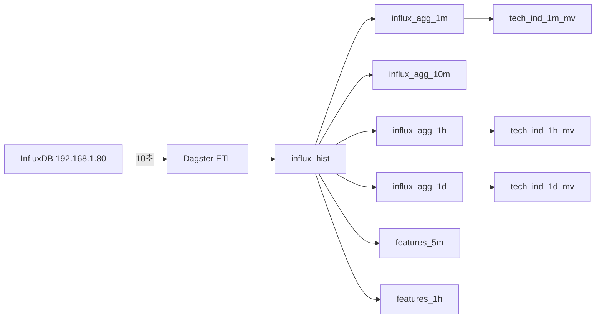

# 🛠️ TimescaleDB 로컬 환경 구현 가이드

## 📝 개요
이 가이드는 리모트 TimescaleDB와 동일한 기능을 로컬 Docker 환경에 구현하는 방법을 설명합니다.

## 🚀 빠른 실행

### 1단계: 누락된 집계 생성
```bash
# SQL 스크립트 실행
docker exec -i ecoanp_timescaledb psql -U ecoanp_user -d ecoanp < db/scripts/create_missing_aggregates.sql
```

### 2단계: 초기 데이터 새로고침
```bash
# 연속 집계 새로고침 (각 명령을 개별 실행)
docker exec ecoanp_timescaledb sh -c "psql -U ecoanp_user -d ecoanp -c \"CALL refresh_continuous_aggregate('influx_agg_10m', NOW() - INTERVAL '7 days', NOW());\""

docker exec ecoanp_timescaledb sh -c "psql -U ecoanp_user -d ecoanp -c \"CALL refresh_continuous_aggregate('influx_agg_1h', NOW() - INTERVAL '30 days', NOW());\""

# Materialized View 새로고침
docker exec ecoanp_timescaledb psql -U ecoanp_user -d ecoanp -c "REFRESH MATERIALIZED VIEW tech_ind_1m_mv;"
docker exec ecoanp_timescaledb psql -U ecoanp_user -d ecoanp -c "REFRESH MATERIALIZED VIEW tech_ind_1h_mv;"
```

### 3단계: 확인
```bash
# 생성된 연속 집계 확인
docker exec ecoanp_timescaledb psql -U ecoanp_user -d ecoanp -c "SELECT * FROM timescaledb_information.continuous_aggregates;"

# 백그라운드 작업 확인
docker exec ecoanp_timescaledb psql -U ecoanp_user -d ecoanp -c "SELECT job_id, application_name, schedule_interval FROM timescaledb_information.jobs ORDER BY job_id;"

# 데이터 확인
docker exec ecoanp_timescaledb psql -U ecoanp_user -d ecoanp -c "
SELECT 
    'influx_agg_10m' as view_name, COUNT(*) as records 
FROM influx_agg_10m 
UNION ALL 
SELECT 'influx_agg_1h', COUNT(*) 
FROM influx_agg_1h;"
```

## 📋 체크리스트

### ✅ 완료된 작업
- [x] influx_hist 하이퍼테이블 생성
- [x] influx_tag 매핑 테이블
- [x] influx_qc_rule QC 규칙
- [x] influx_agg_1m 연속 집계
- [x] influx_agg_1d 일별 집계
- [x] influx_latest 최신값 뷰
- [x] tech_ind_1d_mv 일별 기술지표
- [x] Dagster ETL 파이프라인
- [x] 10초 데이터 수집 센서
- [x] AI 관련 테이블 (conversations, knowledge_base)
- [x] 예측 테이블 (predictions, anomalies)

### 🔄 진행 중
- [ ] influx_agg_10m 연속 집계
- [ ] influx_agg_1h 연속 집계
- [ ] features_5m 통계 뷰
- [ ] features_1h 통계 뷰
- [ ] tech_ind_1m_mv 기술지표
- [ ] tech_ind_1h_mv 기술지표
- [ ] 압축 정책 설정

### ⏳ 추후 작업
- [ ] pg_vector 확장 설치
- [ ] pg_stat_statements 설치
- [ ] 성능 모니터링 대시보드
- [ ] Grafana 연동
- [ ] 알림 시스템

## 🔧 문제 해결

### 연속 집계 생성 오류
```sql
-- 이미 존재하는 경우 삭제 후 재생성
DROP MATERIALIZED VIEW IF EXISTS influx_agg_10m CASCADE;
```

### 압축 정책 오류
```sql
-- 압축 활성화
ALTER TABLE influx_hist SET (
    timescaledb.compress,
    timescaledb.compress_segmentby = 'tag_name',
    timescaledb.compress_orderby = 'ts DESC'
);
```

### 메모리 부족
```yaml
# docker-compose.dagster.yml 수정
deploy:
  resources:
    limits:
      memory: 8G  # 증가
```

## 📊 모니터링 쿼리

### 시스템 상태
```sql
-- 데이터 수집 상태
SELECT 
    MAX(ts) as latest_data,
    EXTRACT(EPOCH FROM (NOW() - MAX(ts))) as seconds_ago,
    COUNT(DISTINCT tag_name) as active_tags
FROM influx_hist
WHERE ts >= NOW() - INTERVAL '10 minutes';

-- 집계 상태
SELECT 
    view_name,
    materialized_only,
    finalized
FROM timescaledb_information.continuous_aggregates;

-- 작업 실행 상태
SELECT 
    job_id,
    application_name,
    schedule_interval,
    config->>'start_offset' as start_offset,
    config->>'end_offset' as end_offset
FROM timescaledb_information.jobs
WHERE application_name LIKE '%Aggregate%';
```

### 성능 확인
```sql
-- 청크 정보
SELECT 
    hypertable_name,
    chunk_name,
    range_start,
    range_end,
    is_compressed
FROM timescaledb_information.chunks
WHERE hypertable_name = 'influx_hist'
ORDER BY range_start DESC;

-- 압축 효과
SELECT 
    pg_size_pretty(before_compression_total_bytes) as before,
    pg_size_pretty(after_compression_total_bytes) as after,
    compression_ratio
FROM timescaledb_information.compression_hypertable_stats
WHERE hypertable_name = 'influx_hist';
```

## 🔄 데이터 플로우 확인



## 📝 참고사항

1. **연속 집계는 트랜잭션 외부에서 새로고침**
   - `CALL refresh_continuous_aggregate()` 명령은 단독 실행 필요

2. **압축 정책은 성능에 영향**
   - 7일 이상 데이터만 압축 권장
   - 압축된 데이터는 업데이트 불가

3. **Materialized View는 수동 새로고침 필요**
   - cron 작업 또는 Dagster 작업으로 자동화 권장

4. **인덱스는 쿼리 패턴에 맞춰 최적화**
   - 자주 사용하는 WHERE 조건에 인덱스 생성

## 🆘 지원

문제 발생 시:
1. Docker 로그 확인: `docker logs ecoanp_timescaledb`
2. Dagster UI 확인: http://localhost:3000
3. TimescaleDB 공식 문서: https://docs.timescale.com/

---
**최종 업데이트**: 2025-09-05  
**버전**: 1.0.0