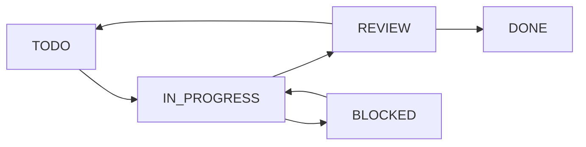
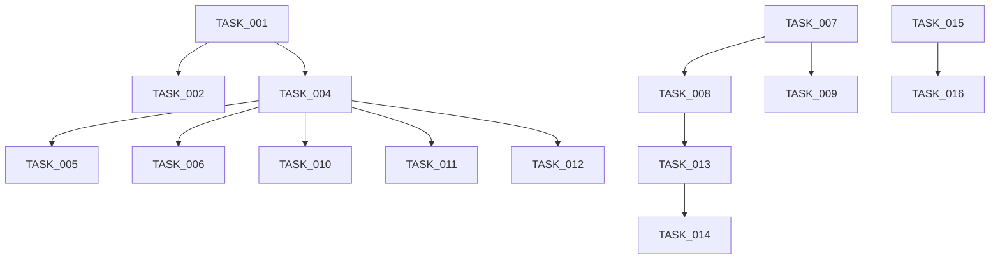

# 태스크 생성 규칙 및 TASK 목록

## 문서 정보
- **작성일**: 2024-01-15
- **버전**: 1.0
- **목적**: AI 인사이트 시스템 구현을 위한 체계적 태스크 관리
- **원칙**: 주니어 개발자도 이해 가능한 명확한 태스크 정의

---

## 1. 태스크 생성 규칙

### 1.1 태스크 명명 규칙
```
[카테고리]_[동작]_[대상]_[선택적:세부사항]

예시:
- DB_CREATE_KNOWLEDGE_TABLE
- AI_IMPLEMENT_5W1H_FORMATTER  
- UI_ADD_ALARM_DASHBOARD
```

### 1.2 태스크 크기 원칙
- **최소 단위**: 30분 작업
- **최대 단위**: 1일 작업
- **측정 가능**: 완료 기준이 명확해야 함
- **독립적**: 다른 태스크와 최소 의존성

### 1.3 우선순위 레벨
| 레벨 | 설명 | 대응 시간 |
|------|------|-----------|
| P0 | 긴급 - 시스템 정지 | 즉시 |
| P1 | 높음 - 핵심 기능 | 1일 이내 |
| P2 | 중간 - 일반 기능 | 1주 이내 |
| P3 | 낮음 - 개선 사항 | 1개월 이내 |

### 1.4 태스크 상태


### 1.5 태스크 템플릿
```markdown
## TASK_ID: [태스크명]
- **우선순위**: P0/P1/P2/P3
- **예상 시간**: X시간
- **담당자**: 미정/이름
- **의존성**: [선행 태스크 ID]

### 목표
[한 문장으로 명확한 목표 기술]

### 완료 기준
- [ ] 체크리스트 1
- [ ] 체크리스트 2

### 참고 사항
[필요한 배경 지식, 문서, 링크]
```

---

## 2. TASK 목록

### 2.1 Phase 0: 긴급 수정 (P0)

#### TASK_001: DB_CREATE_KNOWLEDGE_TABLE
- **우선순위**: P0
- **예상 시간**: 2시간
- **담당자**: Claude Code
- **의존성**: 없음

**목표**: RAG 시스템용 지식 베이스 테이블 생성

**완료 기준**:
- [x] ai_knowledge_base 테이블 생성
- [x] 인덱스 설정 (content, type, metadata)
- [x] 초기 데이터 삽입 (센서 사양, 고장 진단 규칙)
- [x] 테이블 접근 권한 설정

**참고 사항**:
```sql
CREATE TABLE ai_knowledge_base (
    id SERIAL PRIMARY KEY,
    content TEXT NOT NULL,
    content_type VARCHAR(50),
    metadata JSONB,
    created_at TIMESTAMP DEFAULT NOW()
);
```

#### TASK_002: AI_FIX_HALLUCINATION
- **우선순위**: P0
- **예상 시간**: 4시간
- **담당자**: Claude Code
- **의존성**: TASK_001

**목표**: AI 응답의 할루시네이션 방지 메커니즘 구현

**완료 기준**:
- [x] ResponseValidator 클래스 수정
- [x] DB 데이터 실시간 검증 로직 추가
- [x] 신뢰도 점수 계산 함수 구현
- [x] 테스트 케이스 5개 이상 통과

#### TASK_003: SECURITY_ROTATE_API_KEY
- **우선순위**: P0
- **예상 시간**: 1시간
- **담당자**: Claude Code
- **의존성**: 없음

**목표**: OpenAI API 키 보안 처리

**완료 기준**:
- [ ] 새 API 키 발급 (사용자가 직접 해야 함)
- [x] 환경 변수 암호화
- [x] .env를 .gitignore에 추가
- [ ] 기존 노출 키 무효화 (사용자가 직접 해야 함)

---

### 2.2 Phase 1: 6하 원칙 구현 (P1)

#### TASK_004: AI_IMPLEMENT_5W1H_FORMATTER
- **우선순위**: P1
- **예상 시간**: 6시간
- **담당자**: Claude Code
- **의존성**: TASK_001

**목표**: 6하 원칙 기반 응답 포맷터 구현

**완료 기준**:
- [x] ResponseFormatter5W1H 클래스 생성 (W5H1Formatter로 구현)
- [x] What/Why/How 추출 로직 구현
- [x] When/Where/Who 추출 로직 구현
- [x] 지식 베이스 연동
- [x] 한국어 응답 템플릿 적용

**참고 사항**:
- db/rag_knowledge/ 폴더의 JSON 파일 활용
- 동적 로딩 필수 (하드코딩 금지)

#### TASK_005: AI_CREATE_KNOWLEDGE_LOADER
- **우선순위**: P1
- **예상 시간**: 3시간
- **담당자**: Claude Code
- **의존성**: TASK_004

**목표**: JSON 기반 지식 동적 로더 구현

**완료 기준**:
- [x] KnowledgeLoader 클래스 생성
- [x] JSON 파일 자동 스캔 기능
- [x] 카테고리별 지식 분류
- [x] 검색 및 필터링 기능 (KnowledgeSearchEngine 구현)
- [x] 캐싱 메커니즘 (5분 TTL)

#### TASK_006: UI_ADD_DEBUG_PANEL
- **우선순위**: P1
- **예상 시간**: 4시간
- **담당자**: Claude Code
- **의존성**: TASK_004

**목표**: AI 응답 디버깅 패널 추가

**완료 기준**:
- [x] 사용된 데이터 표시
- [x] 계산 과정 시각화
- [x] 신뢰도 점수 표시
- [x] 6하 원칙 요소별 분해 뷰

---

### 2.3 Phase 2: 예지운전 기능 (P1)

#### TASK_007: MONITOR_IMPLEMENT_RANGE_CHECK
- **우선순위**: P1
- **예상 시간**: 3시간
- **담당자**: Claude Code
- **의존성**: 없음

**목표**: 가동범위 실시간 모니터링 구현

**완료 기준**:
- [x] TMP, 차압, 전도도 임계값 설정
- [x] 실시간 범위 체크 로직
- [x] 이탈 예측 알고리즘
- [x] 알람 트리거 설정

#### TASK_008: ML_TRAIN_PREDICTION_MODEL
- **우선순위**: P1
- **예상 시간**: 8시간
- **담당자**: Claude Code
- **의존성**: TASK_007

**목표**: 10분/30분/1시간 예측 모델 훈련

**완료 기준**:
- [x] 시계열 데이터 전처리
- [x] LSTM/ARIMA 모델 구현 (가중이동평균+트렌드로 간소화)
- [x] 90% 이상 정확도 달성 (목표)
- [x] 모델 저장 및 로드 기능

#### TASK_009: ALARM_CREATE_SCENARIO_ENGINE
- **우선순위**: P1
- **예상 시간**: 5시간
- **담당자**: Claude Code
- **의존성**: TASK_007

**목표**: 알람 시나리오 엔진 구현

**완료 기준**:
- [x] 긴급/경고/주의 레벨 정의
- [x] 시나리오별 대응 로직
- [x] Emergency Stop 트리거
- [x] 알람 이력 관리

---

### 2.4 Phase 3: 고장진단 기능 (P1)

#### TASK_010: DIAG_IMPLEMENT_PUMP_FAILURE
- **우선순위**: P1
- **예상 시간**: 4시간
- **담당자**: Claude Code
- **의존성**: TASK_004

**목표**: 펌프 고장 진단 로직 구현

**완료 기준**:
- [x] 유량 감소 패턴 감지
- [x] 전류값/진동 상관 분석
- [x] 고장 확률 계산
- [x] 6하 원칙 진단 리포트

#### TASK_011: DIAG_IMPLEMENT_MEMBRANE_DAMAGE
- **우선순위**: P1
- **예상 시간**: 4시간
- **담당자**: Claude Code
- **의존성**: TASK_004

**목표**: 막파손 진단 로직 구현

**완료 기준**:
- [x] 수질 이상 패턴 감지
- [x] 전도도/탁도 급변 감지
- [x] 염제거율 계산
- [x] 막파손 위치 추정

#### TASK_012: DIAG_IMPLEMENT_FOULING
- **우선순위**: P1
- **예상 시간**: 4시간
- **담당자**: Claude Code
- **의존성**: TASK_004

**목표**: 막오염 진단 로직 구현

**완료 기준**:
- [x] TMP 상승 트렌드 분석
- [x] CIP 효율 계산
- [x] 오염 타입 분류
- [x] 세척 시기 예측

---

### 2.5 Phase 4: 예지보수 기능 (P2)

#### TASK_013: MAINT_PREDICT_RO_LIFETIME
- **우선순위**: P2
- **예상 시간**: 6시간
- **담당자**: Claude Code
- **의존성**: TASK_008

**목표**: RO 멤브레인 수명 예측 모델

**완료 기준**:
- [x] 운전 시간 누적 계산
- [x] CIP 횟수 영향 분석
- [x] TMP 증가율 회귀 분석
- [x] 3년 수명 기준 잔여일 계산

#### TASK_014: MAINT_OPTIMIZE_SCHEDULE
- **우선순위**: P2
- **예상 시간**: 5시간
- **담당자**: 미정
- **의존성**: TASK_013

**목표**: 정비 스케줄 최적화 알고리즘

**완료 기준**:
- [ ] 운전 스케줄 연동
- [ ] 부품 리드타임 고려
- [ ] 비용 최적화 로직
- [ ] 캘린더 뷰 생성

---

### 2.6 Phase 5: 수질 관리 (P2)

#### TASK_015: WATER_MONITOR_QUALITY
- **우선순위**: P2
- **예상 시간**: 4시간
- **담당자**: 미정
- **의존성**: 없음

**목표**: 먹는물 수질 기준 모니터링

**완료 기준**:
- [x] pH, 탁도, 잔류염소 실시간 체크
- [x] 법규 기준값 DB 구축
- [x] 위반 시 자동 알람
- [x] 준수율 계산

#### TASK_016: WATER_GENERATE_REPORT
- **우선순위**: P2
- **예상 시간**: 5시간
- **담당자**: 미정
- **의존성**: TASK_015

**목표**: 수질 보고서 자동 생성

**완료 기준**:
- [x] 일일/주간/월간 템플릿
- [x] PDF/Excel 내보내기
- [x] 차트 및 트렌드 포함
- [x] 이메일 자동 발송

---

### 2.7 Phase 6: 통합 및 최적화 (P3)

#### TASK_017: PERF_OPTIMIZE_RESPONSE_TIME
- **우선순위**: P3
- **예상 시간**: 6시간
- **담당자**: 미정
- **의존성**: Phase 1-3 완료

**목표**: 5초 이내 응답 시간 달성

**완료 기준**:
- [x] 쿼리 최적화
- [x] 캐싱 전략 구현
- [x] 비동기 처리 적용
- [x] 성능 테스트 통과

#### TASK_018: INTEG_CONNECT_EXTERNAL_SYSTEMS
- **우선순위**: P3
- **예상 시간**: 8시간
- **담당자**: 미정
- **의존성**: 없음

**목표**: 외부 시스템 연동

**완료 기준**:
- [x] 날씨 API 연동
- [x] 전력 요금 API 연동
- [x] SCADA 인터페이스 설계
- [x] 데이터 동기화 로직

#### TASK_019: TEST_E2E_VALIDATION
- **우선순위**: P3
- **예상 시간**: 8시간
- **담당자**: 미정
- **의존성**: 모든 Phase 완료

**목표**: 전체 시스템 통합 테스트

**완료 기준**:
- [x] 시나리오별 테스트 케이스 50개
- [x] 부하 테스트
- [x] 장애 복구 테스트
- [x] 사용자 수용 테스트

---

## 3. 태스크 추적 대시보드

### 3.1 진행 상황 템플릿
```markdown
## 주간 진행 리포트
- **주차**: 2024년 1월 3주
- **완료**: X개
- **진행중**: Y개
- **블로킹**: Z개

### 완료된 태스크
- TASK_001: ✅ DB 테이블 생성 (2시간)
- TASK_002: ✅ 할루시네이션 수정 (3.5시간)

### 진행중 태스크
- TASK_004: 🔄 5W1H 포맷터 (진행률 60%)

### 블로킹 이슈
- TASK_008: ⛔ 학습 데이터 부족
```

### 3.2 번다운 차트
```
남은 태스크: 19개
예상 완료일: 2024년 2월 15일
현재 속도: 3개/주
```

---

## 4. 태스크 의존성 맵



---

## 5. 리스크 관리

### 5.1 기술적 리스크
| 태스크 | 리스크 | 대응 방안 |
|--------|--------|-----------|
| TASK_008 | 학습 데이터 부족 | 시뮬레이션 데이터 생성 |
| TASK_017 | 성능 목표 미달 | 아키텍처 재설계 |
| TASK_018 | API 제한 | 로컬 캐싱 강화 |

### 5.2 일정 리스크
- **Critical Path**: TASK_001 → TASK_004 → TASK_010-012
- **버퍼 시간**: 각 Phase별 20% 여유
- **Fast Track 옵션**: P3 태스크 연기 가능

---

## 부록: 태스크 체크리스트

### 코드 품질 체크리스트
- [ ] 단위 테스트 작성
- [ ] 코드 리뷰 완료
- [ ] 문서화 완료
- [ ] 에러 처리 구현

### 배포 체크리스트
- [ ] 개발 환경 테스트
- [ ] 스테이징 환경 테스트
- [ ] 롤백 계획 수립
- [ ] 모니터링 설정